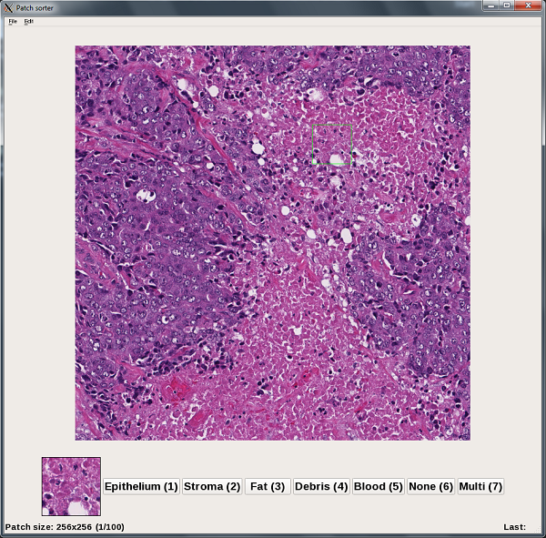

# patchSorter
Python GUI utility for sorting image patches

Created August, 2015 by Marcello DiStasio

Randomly presents user with subregions of an image ("patches") and lets user select between two categories for each patch, saving the patches as individual *.jpg files in two output directories.

##Screenshot##


##Usage##

Basic invocation with default options is:
```
python SortPatches.py -i <inputfile.jpg>
```
This is create two directories in the same directory of ths input file named `<inputfile>_interesting` and `<inputfile>_boring`, and sort the patches into these.  The full options are:
```
python SortPatches.py -i <inputfile> -o <outputdir> -s <patchheight>,<patchwidth>
```
Which lets you specify the output directory basenames (`<outputdir>_interesting` and `<outputdir>_boring` will be created), and set a custom patch size (the default is 32x32).  The patch dimensions must be multiples of 8, and will be rounded up to the nearest multiple of 8 otherwise.

